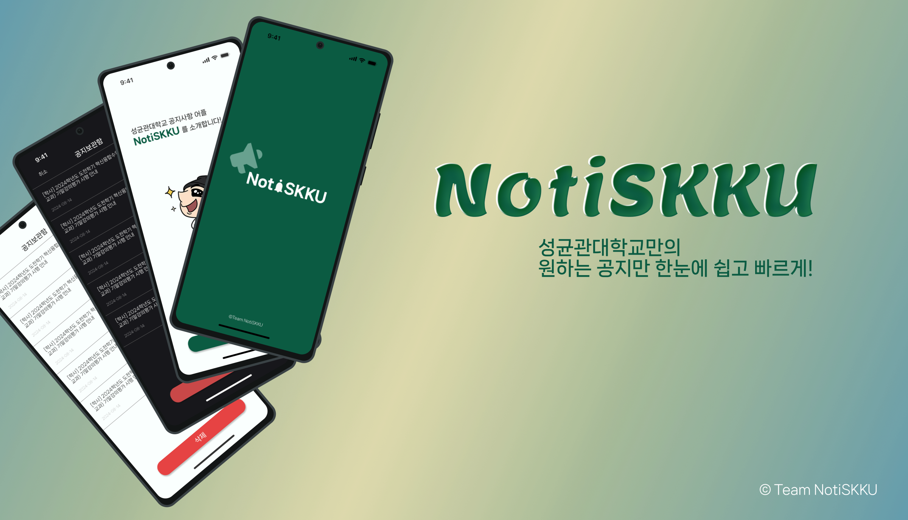

# NotiSKKU

> **노티스꾸**: 성균관대학교 맞춤형 공지사항 알림 애플리케이션   
> 학과별, 키워드별 공지를 받아보고 학사일정을 한눈에 확인하세요!

_본 레포지토리는 NotiSKKU 프로젝트의 프론트엔드 및 푸시알림 레포지토리입니다._    
→ [NotiSKKU Backend Repository 바로가기](https://github.com/Team-Notiskku/backend)



<br/>

## ✨ 주요 기능

### 맞춤형 키워드 및 알림 설정하기!
<p align="center">
  
</p>

관심 있는 키워드를 설정하고 해당 키워드가 포함된 공지사항을 실시간으로 받아보세요.   
푸시 알림 설정으로 중요한 공지를 놓치지 마세요!

---

### 원하는 공지는 즐겨찾기로 간편하게!
<p align="center">
  
</p>

중요한 공지사항을 별표로 저장하고 공지보관함 탭에서 한눈에 모아보세요.   
편집 모드로 여러 공지를 한 번에 관리할 수 있습니다.

---

### 학사일정도 한눈에!
<p align="center">
  
</p>

성균관대학교의 모든 학사일정을 캘린더로 확인하세요.   
날짜를 탭하면 해당 일의 상세 일정을 바로 볼 수 있습니다.

<br/>

## 🏛️ 시스템 아키텍처

<p align="center">
  
</p>

NotiSKKU는 **Flutter 기반**으로 구현되었으며, Firebase를 메인으로 Playwright과 Github Actions를 활용합니다.

### 주요 구성 요소
- **Frontend**: Flutter (Dart) + Riverpod 상태 관리
- **Backend**: Firebase (Firestore, FCM) + Playwright(Python based) + Github Actions
- **Local Storage**: SharedPreferences
- **Architecture Pattern**: MVVM + Repository Pattern

<br/>

## 🏗️ 프로젝트 구조

```
notiskku/
├── lib/
│   ├── api/              # Firebase API
│   ├── data/             # 정적 데이터
│   ├── models/           # 데이터 모델
│   ├── providers/        # 상태 관리 (Riverpod)
│   ├── screen/           # 온보딩 화면
│   ├── tabs/             # 메인 탭 화면
│   ├── services/         # 서비스 레이어
│   ├── widget/           # UI 컴포넌트
│   └── main.dart
├── assets/               # 이미지, 폰트, 데이터
├── android/              # Android 설정
├── ios/                  # iOS 설정
└── test/                 # 테스트 코드
```

<br/>

## ⚙️ 요구사항

### 개발 환경
- **Flutter SDK**: 3.7.0 이상
- **Dart**: 3.7.0 이상
- **Android Studio** 또는 **Xcode** (플랫폼별)

### Firebase 설정
- Firebase 프로젝트 생성 필요
- `google-services.json` (Android)
- `GoogleService-Info.plist` (iOS)

<br/>

## 📦 설치

1. **레포지토리 클론**
```bash
git clone https://github.com/Team-Notiskku/NotiSKKU.git
cd NotiSKKU/notiskku
```

2. **의존성 설치**
```bash
flutter pub get
```

3. **Firebase 설정**
```bash
# Firebase CLI 설치 (선택)
npm install -g firebase-tools

# FlutterFire CLI로 Firebase 설정
flutterfire configure
```

4. **Firebase 설정 파일 확인**
- Android: `notiskku/android/app/google-services.json`
- iOS: `notiskku/ios/Runner/GoogleService-Info.plist`

<br/>

## ▶️ 실행

### Android
```bash
flutter run -d android
```

### iOS
```bash
flutter run -d ios
```

### Web
```bash
flutter run -d chrome
```

### 특정 디바이스에서 실행
```bash
# 연결된 디바이스 확인
flutter devices

# 특정 디바이스에서 실행
flutter run -d <device-id>
```

<br/>

## 🏗️ 빌드

### Android APK
```bash
flutter build apk --release
```

### Android App Bundle (Google Play Store)
```bash
flutter build appbundle --release
```

### iOS
```bash
flutter build ios --release
```

<br/>

## 🧪 테스트

```bash
# 전체 테스트 실행
flutter test

# 특정 테스트 파일 실행
flutter test test/widget_test.dart

# 코드 커버리지
flutter test --coverage
```

<br/>

## 📌 커밋 컨벤션

| 태그 | 설명 | 예시 |
|------|------|------|
| `feat` | 새로운 기능 추가 | `feat: 키워드 알림 기능 추가` |
| `fix` | 버그 수정 | `fix: 즐겨찾기 삭제 오류 수정` |
| `design` | UI/UX 변경 | `design: 메인 화면 레이아웃 개선` |
| `style` | 코드 포맷 (기능 변경 없음) | `style: 코드 포맷팅 적용` |
| `refactor` | 코드 리팩토링 | `refactor: UserNotifier 로직 개선` |
| `docs` | 문서/주석 변경 | `docs: README 업데이트` |
| `test` | 테스트 코드 추가/수정 | `test: Notice 모델 단위 테스트` |
| `chore` | 빌드 설정, 패키지 매니저 | `chore: pubspec.yaml 의존성 업데이트` |
| `perf` | 성능 최적화 | `perf: 공지 로딩 속도 개선` |

<br/>

## 📄 라이선스

이 프로젝트는 **MIT 라이선스** 하에 배포됩니다.
자세한 내용은 [LICENSE](../License) 파일을 참조하세요.

<br/>

## 🙋‍♂️ 기여 방법

1. **Fork** 이 저장소를 Fork합니다.

2. **브랜치 생성** 새로운 브랜치를 생성합니다.
```bash
git checkout -b feature/AmazingFeature
```

3. **커밋** 커밋 컨벤션을 지켜서 커밋합니다.
```bash
git commit -m 'feat: Add some AmazingFeature'
```

4. **Push** 브랜치에 Push합니다.
```bash
git push origin feature/AmazingFeature
```

5. **Pull Request** Pull Request를 생성하고 리뷰를 요청합니다.

<br/>

## 📞 문의

- 📧 Email: notiskkuu@gmail.com
- GitHub Issues: [Issues 페이지](https://github.com/Team-Notiskku/NotiSKKU/issues)

<br/>

## 🔗 관련 링크

- [Organization NotiSKKU](https://github.com/Team-Notiskku)
- [Google Play Store (will soon be available)]()
- [App Store (will soon be available)]()

<br/>

---
Made with ❤️ by Team Notiskku
